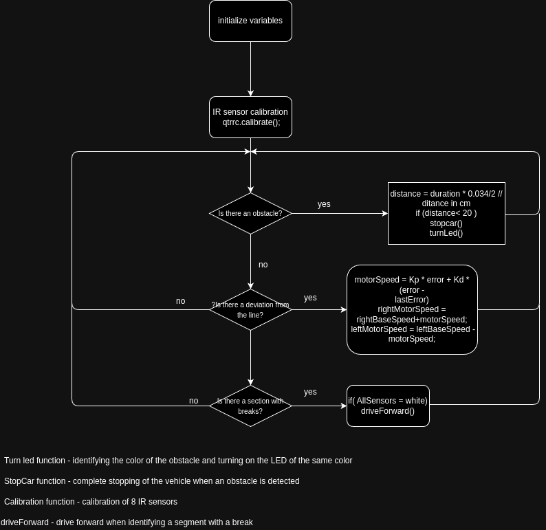

# Autonomous Line Following Robot with Obstacle Detection Using Arduino Uno

## Description

This repository contains the code for an autonomous line-following robot equipped with obstacle detection capabilities, built using an Arduino Uno. The robot uses QTR sensors to follow a line and the APDS9960 sensor to detect obstacles in its path. When an obstacle is detected, the robot stops and displays the detected color using an RGB LED.

## Features

- **Line Following:** Uses QTR sensors to follow a predefined line on the ground.
- **Obstacle Detection:** Utilizes the APDS9960 sensor to detect obstacles and stop the robot.
- **Color Detection:** Reads color values from the APDS9960 sensor and displays the detected color using an RGB LED.
- **Proportional-Derivative Control:** Ensures smooth and accurate line following with adjustable parameters.
- **Test Modes:** Includes modes for testing sensor readings and proximity detection.

## Components

- **Arduino Uno:** The main microcontroller for the project.
- **QTR Sensors:** 8 sensors arranged in a line for detecting the path.
- **APDS9960 Sensor:** Used for proximity and color detection.
- **Motors:** Controlled using PWM signals to adjust speed based on sensor input.
- **RGB LED:** Displays colors detected by the APDS9960 sensor.
- **Motor Driver:** Interface for controlling the motors' speed and direction.

## Setup and Calibration

### Wiring
- Connect the QTR sensors to analog pins A0-A7.
- Connect the APDS9960 sensor to the appropriate I2C pins (A4 for SDA, A5 for SCL).
- Connect the motors and motor driver to the specified digital pins.
- Connect the RGB LED to the specified digital pins.

### Calibration
- During setup, the QTR sensors will be calibrated by sliding the sensors across the line. Ensure the sensors are exposed to the brightest and darkest readings.
- Calibration data will be printed if `TEST_MODE_SENSORS` is enabled.

## Usage

### Upload the Code
- Upload the provided code to your Arduino Uno board.

### Run the Robot
- Position the robot on the line and power it on.
- The robot will start following the line using the QTR sensors.
- When an obstacle is detected within the specified distance, the robot will stop and display the detected color using the RGB LED.

### Adjusting Parameters
- Tune the `Kp` and `Kd` values for the PD controller to achieve optimal line-following performance.
- Adjust the `DISTANSE` value for proximity detection as needed.

## Demonstration

[![Video Presentation]](the_robot_competition.mp4)

## Construction

## Contributions

Contributions are welcome! Feel free to submit issues and pull requests to improve the functionality and performance of the robot.

